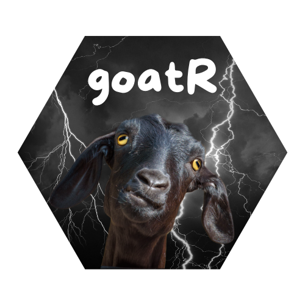

<!-- README.md is generated from README.Rmd. Please edit that file -->

# goatR <a href="goatR"></a>

<!-- badges: start -->
<!-- badges: end -->

In this package, you will find various functions for working with
meteorological data, as well as some datasets containing information
from different weather stations.

``` r
# install.packages("pak")
pak::pak("bdirienzo/goatR")
```

## Code of Conduct

Please note that the goatR project is released with a [Contributor Code
of
Conduct](https://contributor-covenant.org/version/2/1/CODE_OF_CONDUCT.html).
By contributing to this project, you agree to abide by its terms.
